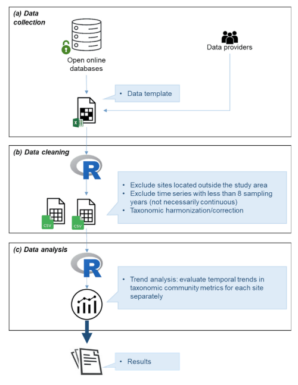

# Biodiversity time series analyses from European marine ecosystems
MarcoBolo WF3 T5.1.1

A tutorial is available in [documentation/BioTiSAn_EuroMarEc_tutorial.ipynb](./documentation/BioTiSAn_EuroMarEc_tutorial.ipynb).
